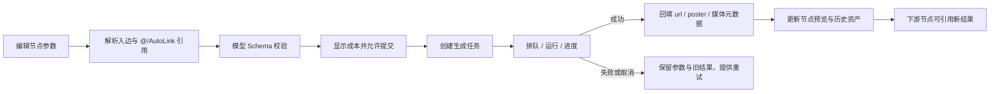

# LibTV 既有项目画布只读拆解

日期：2026-08-14  
审查入口：`https://www.liblib.tv/project` 及账号下既有画布  
审查方式：登录态内置浏览器只读浏览；LibTV 官方 CLI 仅执行项目摘要查询，用于解析有效 ID、校验 Store 层节点/边总量和 source/target 关系。界面、交互和布局结论均来自浏览器实际渲染内容；CLI 数据只作为画布虚拟化与数据模型的交叉证据。

## 1. 审查边界与安全约束

- 全程没有点击生成提交按钮、节点增强生成按钮、Skill“使用”按钮、工具箱“使用”按钮、资产“使用/应用至画布”按钮、发布按钮或积分入口。
- 没有创建、复制、重命名、移动或删除项目、画布、节点、连线、资产。
- 允许的只读动作仅包括：打开项目/画布、选中既有节点、打开/关闭面板、切换面板标签、查看节点列表和快捷键。
- 页面在当前内置浏览器中以约 `361 × 863 CSS px` 的窄视口呈现。部分桌面顶栏控件在首屏加载骨架中短暂出现，画布 hydration 完成后被响应式布局隐藏；本文对此单独标注，不把未实际打开的内容写成已验证功能。
- 两个历史上使用过的画布 URL 当前返回“数据不存在”，未纳入功能结论；最终通过官方只读列表得到当前有效画布 ID 后再在浏览器打开。

## 2. 项目列表结构

项目页采用深色双列卡片网格，每张项目卡包括：

1. 16:9 封面缩略图；
2. 项目名称；
3. 最近更新时间；
4. 右侧三点更多菜单；
5. 更多菜单项：打开、重命名、修改封面、创建副本、移动至文件夹、删除项目。

页面顶部还有“全部项目”“新建文件夹”和“开始创作 / 创建新的视频项目”。本次只读审查没有执行任何创建或项目管理动作。

账号项目列表中可见：未命名、汴京灯灭前、天宫之约、花间、汴京半日闲B、汴京半日闲、北美、广西三月三、THE BREACH 裂隙-副本、达布拉、名斛春、Andydb 等。

## 3. 本次重点打开的 3 个有内容画布

| 项目（工作区） | 画布 | 画布地址 | 主要内容 |
| --- | --- | --- | --- |
| 未命名工作区（ID `5393054`） | 画布 1（`615ccac6cc34430b96bd6371b2203837`） | `https://www.liblib.tv/canvas?spaceId=5393054&projectId=615ccac6cc34430b96bd6371b2203837` | 项目共 19 节点、10 条边；浏览器当前视窗完整检查了其中 1 个含 4 张结果的图片生成节点 |
| 汴京灯灭前（ID `5324604`） | 汴京灯灭前（`0e7ebfa056b04fe381d69401d8d698c1`） | `https://www.liblib.tv/canvas?spaceId=5324604&projectId=0e7ebfa056b04fe381d69401d8d698c1` | 13 个图片节点、13 个视频节点、13 条图片→视频连线 |
| 汴京半日闲（ID `4364581`） | 海底鲛人（`598effa469b240f789ec612b92e1b9e1`） | `https://www.liblib.tv/canvas?spaceId=4364581&projectId=598effa469b240f789ec612b92e1b9e1` | 项目共 21 节点、10 条边；当前视窗渲染 3 个图片节点、2 个视频节点和 6 条连线 |

补充检查了“天宫之约 / 画布 1”“花间 / 画布 1”“汴京半日闲 / 浮世万象”；这些画布在当前视图中没有渲染节点，因此不作为主要案例。

## 4. 画布工作台整体布局

### 4.1 顶部区域

- 加载骨架阶段可见：项目名称输入框（当时为禁用加载态）、画布下拉、工作流/故事板切换。
- 窄视口完成加载后，顶部收敛为画布名称下拉（如“画布 1”“汴京灯灭前”“海底鲛人”）和同步/网络状态。
- 页面多次显示“网络不稳定”状态，但既有节点、媒体、连线和面板仍可读取。
- 当前窄视口下，工作流/故事板切换在 hydration 后不再渲染，这是明确观察到的响应式行为。

### 4.2 中央无限画布

- 采用可缩放、可平移的节点画布；节点具备选中、拖动和左右连接端口。
- “整理画布”会提供自动适配入口，当前案例整体缩放分别约为 18%、10%、42%。本次只读取状态，没有触发重新排布。
- 视窗外节点与边会被虚拟化：例如“海底鲛人”资产管理/CLI 摘要确认 21 个节点、10 条边，但当前 DOM 只渲染与视窗邻近的 5 个节点、6 条边；“未命名工作区”CLI 摘要确认 19 个节点、10 条边，而浏览器当前视窗只完整检查了其中一个图片节点。
- 视窗没有节点时，页面提供“当前视窗没有节点 / 返回节点”提示。

### 4.3 底部中央工具坞

实测工具坞包含 8 个入口：

1. 添加节点；
2. 移动；
3. 打开工具箱；
4. 素材库；
5. 角色库；
6. 历史记录；
7. 快捷键；
8. 教程。

工具坞悬浮于画布底部中央，使用图标按钮，当前窄视口仍完整可达。

### 4.4 左下画布控制区

- 资产管理；
- 整理画布（快捷键提示 `Option + Shift + F`）；
- 切换小地图；
- 显示/隐藏节点连线；
- 网格吸附；
- 缩放百分比/缩放选项。

## 5. 节点类型与创建入口

只打开“添加节点”菜单、未选择任何类型。菜单分为“添加节点”和“添加资源”两组。

### 5.1 添加节点

- 文本；
- 图片；
- 视频；
- 智能剪辑（Beta）；
- 导演台（NEW）；
- 逐帧拉片（SD 2.5）；
- 音频；
- 脚本；
- 素材库。

### 5.2 添加资源

- 上传；
- 从生成历史选择。

本次 3 个主要案例里实际存在的节点类型为图片和视频；没有据此推断其他类型的内部卡片结构。

## 6. 图片节点信息结构

### 6.1 折叠/未选中态

图片节点卡片至少包括：

- 节点名称；
- 输出尺寸（例如 `1456 × 816`）；
- 图片预览；
- 多结果数量（例如“4张”）；
- 左侧 target 与右侧 source 连接端口。

“未命名工作区 / 画布 1”的完整图片节点包含 4 张现有结果。节点选中后展开为生成参数卡，但本次没有点击提交按钮。

### 6.2 选中后的生成参数区

实测可见：

- “参考”“风格”快捷入口；
- 文本提示词输入区；
- 模型选择（案例为 `Style Image V8.2`）；
- 画面配置（`16:9 · 自适应 · 4张`）；
- 高级设置；
- 个性化风格 P 值；
- 风格化程度（案例值 100）；
- 怪异度（案例值 0）；
- 多样性（案例值 5）；
- 智能引用 AutoLink 开关（当前开启）；
- 右下生成提交图标按钮（只观察，未点击）。

### 6.3 图片节点上下文操作

选中图片节点时，节点附近出现横向上下文操作条：

- 人像质感调节（NEW）；
- 全景；
- 多角度；
- 打光；
- 九宫格；
- 高清；
- 宫格切分；
- 若干仅显示图标、没有可访问名称的操作。

“海底鲛人”中既有图片节点分为两种表现：有的保留完整四图生成记录，有的更像单张资产卡，仅显示名称、尺寸、预览和上下文处理入口。

## 7. 视频节点信息结构

### 7.1 折叠/未选中态

- 节点名称（如“视频节点 16”）；
- 输出尺寸（如 `1280 × 720`、`1924 × 1076`、`1920 × 1080`）；
- 视频封面/播放器；
- 左侧 target 与右侧 source 连接端口。

### 7.2 “汴京灯灭前 / 视频节点 16”选中态

现有媒体时长约 3.04 秒，播放器标尺显示 `0:00` 到 `0:03`。选中后完整操作分为四层：

1. **媒体处理**：剪辑、片段重拍（当前禁用）、裁剪、高清、逐帧拉片、智能续写（当前禁用）、智能去字幕、音频分离、画面编辑。
2. **帧操作**：截取首帧、截取尾帧、截取当前帧。
3. **引用与控制**：参考、标记、特效、主体、角色库、运镜、`@` 引用。
4. **生成参数**：提示词、模型 `Kling O3`、模式“全能参考”、`16:9 · 3s · 1个`、智能分镜、高级设置、AutoLink 开关。生成提交按钮左侧显示闪电图标与数值 `24`；结合它紧邻提交按钮、随当前模型配置出现的位置，可确认这是本次配置的成本提示，但页面没有补充可访问名称，本文不进一步推断其具体结算单位。

节点中保存的现有提示词是完整镜头运动描述，包含摄影机横移/前推、人物动作、服装风动、云海与光线变化及“无抖动/无滑步/无背景闪烁”等稳定性约束，说明视频节点不仅保存媒体结果，也保存可继续编辑的生成语义。

## 8. 连线方式与依赖关系

### 8.1 视觉和命中结构

- 节点左侧是 target 端口，右侧是 source 端口。
- 连线为平滑贝塞尔曲线。
- “汴京灯灭前”每条连线由两层路径组成：约 20px 的透明交互命中层 + 2px 的可见线条层。
- 连线元素可选中，并带有明确的可访问名称：`Edge from <sourceId> to <targetId>`。
- “隐藏节点连线”是全局画布控制，不需要逐边操作。

### 8.2 “汴京灯灭前”的依赖结构

- 13 个图片节点位于上方/前段；13 个视频节点位于下方/后段。
- 实测 13 条边，每条都从一个图片节点连向一个视频节点，形成一对一的图片→视频生成链。
- 没有看到文本、脚本或音频节点参与该项目的现有连线。

### 8.3 “海底鲛人”的依赖结构

- 项目摘要确认共有 21 个节点、10 条边；当前视窗只渲染 3 个图片节点、2 个视频节点和 6 条边。
- 部分边的端点节点不在当前 DOM 中；结合资产管理和只读项目摘要，可判断画布使用视窗虚拟化，不能仅按当前 DOM 节点/边数判断项目总规模。
- 可见结构仍表现为图片 source → 视频 target；没有观察到视频→图片反向连接。

## 9. 面板与弹窗布局

### 9.1 资产管理侧栏

以可调宽侧栏/对话框方式覆盖在画布一侧，包含：

- 项目名称输入框；
- 当前画布下拉；
- “画布 / 资产”双标签；
- 资产管理入口；
- 画布元素的类型筛选与搜索；
- 全部分组收起；
- 节点列表、每项“定位到节点”和“更多操作”；
- 面板宽度拖动分隔条；
- 底部总数（“海底鲛人”为“共 21 节点”）。

“资产”标签包含：个人 / Agent 来源切换、搜索框、搜索按钮、素材类型筛选和“历史资产”文件夹。

### 9.2 历史记录面板

- 标题“历史资产”；
- 图片历史、视频历史、音频历史标签；
- 当前账号显示数量：图片 2117、视频 431、音频 2；
- 时间降序、批量操作；
- 按日期分组（当前可见 `2026-08-14`）；
- 每项提供“查看 / 使用 / 下载”。

本次没有点击“使用”或“下载”。这些数量更像账号级历史，不应误写为当前项目专属数量。

### 9.3 工具箱面板

- “我的工具箱”；
- 工具箱模板说明；
- 分类/主题入口（当前可见“周星驰经典名场面”）；
- 模板缩略图、名称和“使用”按钮。

实测模板包括左/右弧滑行、电商手机弹出效果、咖啡杯出场、360 旋转展示、机械臂视角、Live 2D、瞳孔拉近、飞鸟解体、破盒而出、商品震撼登场、颠倒空间、反重力漂浮、粒子融解、旅拍转场、英雄视角、AI 模特服饰动态展示、大师分镜九宫格、AI 室内装修效果预览等。所有“使用”按钮均未点击。

### 9.4 素材库面板

当前呈现两个大入口：

- 风格库——新增风格节点（NEW）；
- 特效库——新增特效节点（NEW）。

只打开面板，没有进入资源或新增节点。

### 9.5 角色库面板

- 独立浮层；
- 关闭按钮；
- 角色筛选；
- “最近使用”复选框；
- “应用至画布”按钮；
- 当前项目显示“暂无素材”，所以“应用至画布”禁用。

### 9.6 Agent 输入区

画布存在 Agent 输入提示：“开始你的创作，或者 @ 引用工作流/节点/资源”。本次没有展开 Agent 的 Skill 推荐、没有发送消息，也没有调用任何 Skill。

## 10. 快捷键与画布交互

快捷键面板分为“创作 / 缩放 / 移动画布 / 其他”四组。

### 10.1 创作

- 成组：`G`；
- 合并分镜组：`Option + G`；
- 解组：`Shift + G`；
- 连线：`L`；
- 复制节点和连线：`D`；
- 生成：`Enter`；
- 新建节点：`Tab`；
- 节点复制：`Option + 拖动节点`；
- 创建副本：`Option + 拖动`。

### 10.2 缩放与移动

- 放大、缩小；
- 适应画布：`0`；
- 键盘移动画布：`Space`；
- 移动工具：`V`；
- 抓手工具：`H`；
- 整理画布：`Option + Shift + F`；
- 同时标注触控板与鼠标交互。

### 10.3 其他

- 撤销：`Z`；
- 重做：`Shift + Z`；
- 删除（面板中显示删除动作，但当前窄视图未完整呈现其键帽）。

本次没有按下 `Enter`，避免触发生成。

## 11. 故事板内容与边界

### 11.1 可确认的故事/镜头素材

“海底鲛人”的画布元素列表可见明确的镜头语义命名：

- 蚌壳月洞门·四鲛执扇；
- 螭首涌泉·红衣鲛人执灯；
- E4 古琴特写·弦起光纹；
- E6 水母空镜·天灯升腾；
- L1 开篇·朱砂披帛鲛人背影·珊瑚宫阙；
- L7 礁石三鲛·水晶宫阙；
- 多个视频节点（8、9、10、11、12、13、14、16、21、22）和图片节点。

这说明项目使用镜头编号 + 场景语义命名组织素材，适合进一步映射为故事板卡片、镜头顺序和视频时间线。

### 11.2 本次未能直接验证的故事板视图

- 页面加载骨架中明确存在“工作流 / 故事板”两个按钮。
- 当前 361px 窄视口在画布完成 hydration 后会移除这两个模式按钮，只保留画布名；尝试在骨架阶段切换时，控件会随 hydration 失效，未形成可持续的故事板页面。
- 因此本文不声称看到了故事板卡片顺序、章节编排、时间线时长或导出联动，也不把“没有切换成功”解释为项目没有故事板。
- 这是一个应被记录的响应式可达性问题：窄视口需要保留模式切换或提供溢出菜单。

## 12. 对我们画布实现的直接启示

1. 节点应区分折叠预览态与选中编辑态，避免所有参数永久占用画布。
2. 图片与视频节点都应保留“媒体结果 + 提示词 + 模型/参数 + 依赖端口”，而不是只有缩略图。
3. 连线命中层应明显宽于可见线条，并提供可访问的 source/target 语义。
4. 画布元素侧栏必须以 Store 全量数据为准，不能只读取当前视窗已渲染节点。
5. 底部工具坞负责高频入口，左下控制负责视图管理，两者职责应分离。
6. 历史资产、个人资产、Agent 资产、工具箱模板、风格库、特效库、角色库应是不同信息架构，不应混成一个素材弹窗。
7. 选中图片与选中视频的上下文操作应按媒体类型变化，且主操作必须在窄视口可达。
8. 工作流/故事板切换需要在窄视口保留入口；可用下拉或溢出菜单代替直接隐藏。
9. 对没有可访问名称的图标按钮，应补 `aria-label`，否则难以理解、测试和使用。
10. 所有可能消耗积分的动作应在视觉和语义上与只读查看、编辑参数、打开面板区分。

## 13. 只读审查结论

LibTV 的既有项目不是单纯“生成结果画廊”，而是以无限画布为核心，将图片/视频媒体、生成参数、节点依赖、资产历史、工具模板、角色/风格/特效资源和 Agent 输入组织在同一工作台中。最成熟的现有工作流是图片节点作为视觉来源，通过一对一连线驱动视频节点；选中节点后再进入对应媒体的精细编辑与二次处理。

本次审查已经覆盖节点类型入口、两类核心卡片、连线实现、选中态操作、资产/历史/工具/角色/素材面板和快捷键。故事板模式的入口已确认存在，但受当前窄视口响应式隐藏影响，故事板专属页面内容仍属于待在宽视口补证的范围。

## 14. 深度分析的证据分级

以下章节把事实与推断分开，避免把“合理的产品实现”误写成 LibTV 已公开的内部代码。

- **直接观察**：登录态页面中实际看到的 DOM、按钮状态、文字、媒体、节点、连线和面板；只执行选择、展开、切换标签等零消耗动作。
- **交叉确认**：LibTV 官方 CLI 的只读项目摘要、节点类型说明与模型 Schema 说明，可确认 Store 层字段和生成约束，但不等于网页前端源码。
- **设计推断**：由 UI 状态、图结构和官方命令契约推导的状态机/队列机制。凡未亲自提交任务验证的部分均明确标为推断。
- **未验证**：需要真实生成、修改项目、使用资产或宽屏故事板才能验证的行为；本次为避免积分和数据变更没有执行。

## 15. 画布工作流操作状态机

### 15.1 项目加载、导航与视图操作

| 功能操作 | 用户动作 | 系统反馈 | 可推断的状态变化 | 证据等级 |
| --- | --- | --- | --- | --- |
| 打开既有画布 | 从项目卡进入，或打开带 `spaceId/projectId` 的 URL | 骨架屏→项目名/画布名→节点与边；同步异常时显示“网络不稳定” | 根据画布 ID 拉取项目快照，hydrate 图 Store，再按视口渲染节点子集 | 直接观察 + 交叉确认 |
| 选择画布 | 打开顶部画布名下拉并选择另一画布 | 主画布内容切换，项目级入口仍保留 | activeCanvasId 改变；旧选择态、视口态和面板上下文应被清理或切换 | 直接观察；清理顺序为推断 |
| 平移画布 | 使用移动模式、Space/V/H 或鼠标/触控板拖移 | 所有节点和边整体移动，工具坞/面板保持固定 | 仅修改 viewport `{x,y}`，不修改节点坐标或项目内容 | 直接观察入口 + 设计推断 |
| 缩放/适应 | 缩放控件、鼠标/触控板或快捷键 `0` | 百分比变化；节点按比例缩放；视窗外元素按需挂载 | 修改 viewport zoom；Fit View 根据 Store 中全量节点包围盒计算视口 | 直接观察 + 交叉确认 |
| 整理画布 | 点击“整理画布”或 `Option+Shift+F` | 预期自动重新排列节点并适配视图 | 与单纯 Fit View 不同，可能写回多个 node.position；本次未点击，是否进入撤销栈未验证 | 入口直接观察；行为推断 |
| 小地图 | 点击“切换小地图” | 小地图显示/隐藏 | 仅本地 UI 偏好改变，不应修改项目图 | 入口直接观察；状态范围推断 |
| 网格吸附 | 点击“网格吸附” | 拖动节点时位置贴合规则网格 | 改变 drag snapping 规则；只有实际拖动后才写 node.position | 入口直接观察；行为推断 |
| 隐藏连线 | 点击“隐藏节点连线” | 所有边视觉隐藏，节点仍保留 | 只改变 view preference；不删除 edge，不改变依赖 | 直接观察入口；语义由命名与图结构确认 |
| 返回节点 | 空视窗点击“返回节点” | 视口回到现有节点区域 | 等价于以全量节点包围盒做 Fit View，不创建节点 | 直接观察提示；实现推断 |

### 15.2 节点选择、移动、组织与复制

| 功能操作 | 用户动作 | 系统反馈 | 可推断的状态变化 | 证据等级 |
| --- | --- | --- | --- | --- |
| 选择节点 | 单击图片/视频节点 | 节点高亮并展开；出现媒体类型专属操作条和生成参数 | selectedNodeId 更新；生成编辑器绑定该节点 `data/params` | 直接观察 |
| 取消选择 | 单击空白或按 Escape | 展开区和上下文操作收起 | selectedNodeId 清空；不丢失已保存结果 | 直接观察到 Escape 取消提示；节点行为推断 |
| 拖动节点 | 在移动模式下拖节点 | 卡片跟随指针，连线实时重算 | 拖动中用临时 position；释放后写回 node.position，并可能进入历史栈/同步队列 | 入口直接观察；持久化时机推断 |
| 复制节点和连线 | 选中后按 `D` | 预期创建副本并复制所选内部关系 | 新 node.id；复制可序列化 data/params，输出资产是否复用原 URL 未验证；新 edge 使用新端点 ID | 快捷键直接观察；复制细节未验证 |
| Option 拖动复制 | 按住 Option 拖节点 | 原节点保留，拖出副本 | 与普通 drag 区分为 clone transaction；释放时一次写入新节点 | 快捷键直接观察；事务模型推断 |
| 成组/解组 | 多选后 `G` / `Shift+G` | 预期节点形成可整体操作的组或解除 | 写入 group/parent 关系或组元数据；不改变生成依赖边 | 快捷键直接观察；字段未验证 |
| 合并分镜组 | 多选后 `Option+G` | 预期把节点组织成分镜语义组 | 除视觉 group 外，可能建立镜头顺序/故事板映射；具体字段未验证 | 快捷键直接观察；联动未验证 |
| 删除 | 选中节点/边后执行删除 | 对象从画布和资产列表移除；依赖边应同步处理 | 图 Store 删除 node/edge；若删 node，应级联删除关联 edge；是否弹影响确认框未验证 | 快捷键入口直接观察；图约束推断 |
| 撤销/重做 | `Z` / `Shift+Z` | 最近画布编辑回退/恢复 | past/present/future 历史指针变化；面板开关、viewport、生成任务是否纳入历史未验证 | 快捷键直接观察；范围未验证 |

### 15.3 新增节点、资源与资产定位

| 功能操作 | 用户动作 | 系统反馈 | 可推断的状态变化 | 证据等级 |
| --- | --- | --- | --- | --- |
| 打开新增菜单 | 点击“添加节点”或按 `Tab` | 菜单列出文本/图片/视频/智能剪辑/导演台/逐帧拉片/音频/脚本/素材库，以及上传/历史 | 进入 node-type picker 状态；此时尚未修改项目 | 直接观察 |
| 新增空节点 | 选择一种节点类型 | 预期在当前视口中心附近创建默认卡片并选中 | 生成唯一 id、type、position、默认 `data/params`，写入图 Store 与历史 | 菜单直接观察；创建未执行 |
| 上传资源 | “添加资源→上传” | 预期文件选择、上传进度、完成后创建资产节点 | 先建立上传任务/资产记录，再把 URL、尺寸/时长回填至节点 | 入口直接观察；流程推断 |
| 从历史选择 | “添加资源→从生成历史选择” | 打开账号历史，选择后创建/填充画布节点 | 复用历史 assetId/URL；不会重新生成，但会写当前画布节点 | 入口与历史面板直接观察；回填方式推断 |
| 资产列表定位 | 资产管理→节点项→“定位到节点” | 画布平移/缩放至目标并选中 | viewport 更新，selectedNodeId 指向 Store 中目标；即使节点原先虚拟化也会被挂载 | 直接观察入口 + 虚拟化交叉确认 |
| 资产列表搜索/筛选 | 输入关键词或选媒体类型 | 节点列表缩小，画布不应删除任何内容 | 仅更新面板 query/filter；底层 nodes 保持不变 | 直接观察 |
| 面板改宽 | 拖动资产管理分隔条 | 侧栏宽度变化、画布可用区域重算 | 本地 layout state 更新，画布 viewport 可能重算但 node.position 不变 | 直接观察 |

### 15.4 连线与依赖编辑

| 功能操作 | 用户动作 | 系统反馈 | 可推断的状态变化 | 证据等级 |
| --- | --- | --- | --- | --- |
| 开始连线 | 从节点右侧 source 端口拖出，或按 `L` 进入连线模式 | 临时线跟随指针，可连接目标突出显示 | connectionDraft 保存 source node/handle；尚未写正式 edge | 端口与快捷键直接观察；草稿状态推断 |
| 完成连线 | 将临时线放到另一节点左侧 target 端口 | 贝塞尔边出现，命中层可选择 | 新建 `{id,source,target,sourceHandle?,targetHandle?}`；target 将 source 视为生成输入 | 直接观察现有边 + 交叉确认 |
| 取消连线 | 在空白释放或 Escape | 临时线消失 | 清除 connectionDraft；不写边，不进入依赖图 | 常规交互推断，未执行 |
| 选择边 | 点击可见线附近的透明命中带 | 边高亮/进入可操作态 | selectedEdgeId 更新；20px 命中层只服务交互，不改变 2px 视觉线 | DOM 直接观察 |
| 删除边 | 选择后删除 | 可见边消失，两个节点保留 | 删除 edge；target 的输入引用失效，生成资格应重新计算 | 图结构交叉确认；删除未执行 |
| 全局隐藏边后编辑 | 隐藏连线 | 边不显示，节点仍可选择 | 正确设计应同时禁用边命中，避免“看不见却能选中”；本次未实际点击隐藏态边 | 设计推断/验收建议 |

依赖方向不是“时间线从左到右”的装饰，而是数据流：`source → target` 表示 source 的媒体/文本可被 target 生成器引用。现有两组主案例都大量使用 `image → video`，与“图片作为首帧/参考，视频节点消费图片”一致。边的视觉方向、右 source/左 target 端口，以及官方 CLI 的入边/出边说明互相吻合。

## 16. 节点与连线数据模型推断

### 16.1 图 Store 的最小模型

官方 CLI 的节点说明与页面行为共同指向 React Flow 风格的数据结构：

```ts
type CanvasNode = {
  id: string
  type: string
  position: { x: number; y: number }
  width?: number
  height?: number
  data: {
    title?: string
    type?: string
    url?: string
    originalUrl?: string
    poster?: string
    alt?: string
    params?: GeneratorParams
    action?: string
    taskInfo?: TaskInfo
    prevTaskInfo?: TaskInfo
    generatorType?: string
    isStale?: boolean
    [domainField: string]: unknown
  }
}

type CanvasEdge = {
  id: string
  source: string
  target: string
  sourceHandle?: string
  targetHandle?: string
}
```

关键分层：

1. `id/type/position/width/height` 属于画布壳层，负责身份、渲染器、布局和虚拟化。
2. `data.url/originalUrl/poster/alt` 属于媒体结果层；图片和视频节点既是生成器，也是可被下游消费的资产。
3. `data.params` 属于生成配置层，包括 prompt、model/modelKey、count、settings、advancedSettings、modeType 等。
4. `action/taskInfo/prevTaskInfo/generatorType/isStale` 属于任务与一致性层，适合表达运行中、上次任务、生成类型及“上游已变化、当前结果过期”。
5. 页面只渲染视口附近的节点/边；资产列表和 CLI 摘要读取的是 Store 全量图。DOM 数量因此不能代表项目数据量。

### 16.2 节点类型和字段语义

| 节点类型 | 主要输入 | 主要持久字段 | 输出/下游语义 |
| --- | --- | --- | --- |
| 文本 | 用户文本、脚本提示 | title/content/prompt（具体字段未在本项目节点中验证） | 可作为图片/视频提示词引用源 |
| 图片 | prompt、模型、参考图、风格、比例、数量、高级参数 | `url/originalUrl/alt/params`，可含多结果与 `showGenerator/rotateAngle` | 输出图片；可连到视频、图片再生成或故事板镜头 |
| 视频 | prompt、模型、模式、图片/视频/音频引用、比例、时长、数量 | `url/poster/params`，另含时长/媒体元数据 | 输出视频；可进入剪辑、逐帧分析、故事板/时间线 |
| 音频 | 音频资产或生成参数 | URL、时长、任务信息（字段未在案例节点中展开） | 可供 audio-to-video 或时间线使用 |
| 脚本/故事板 | 标题、脚本行、镜头列、视图、生成配置 | `rows/shotColumns/viewMode/activeViewId/sourceType/scriptModel/imageGenConfig` | 行可关联图片/视频节点，驱动镜头级生成与编排 |
| 智能剪辑/导演台/逐帧拉片 | 已有媒体和指令 | 专用 params/task/result（本次未创建，字段待验证） | 产生派生媒体、分析结果或新的下游节点 |

官方说明中故事板画布节点的 React Flow `type` 可为 `storyboard`，其业务 `data.type` 为 `script`。这解释了“节点渲染类型”和“内容领域类型”需要分开：前者选择组件，后者决定数据语义。

### 16.3 端口与边的约束

- 左端口为 incoming target：当前节点消费哪些上游输入。
- 右端口为 outgoing source：当前节点的结果被哪些下游节点消费。
- `source → target` 不自动等同于父子 DOM 或视觉分组；它是一条生成依赖。
- 生成提示词可通过类似 `{{Node <nodeKey>}}` 的引用占位关联上游；页面中的 `@` 和 AutoLink 是这一机制的可视化入口。
- 模型的 `modeType` 可约束上游媒体类型与数量，例如单图生视频、首尾帧生视频、多参考视频。连接是否可用不能只按 node.type 判断，还要结合当前模型模式。
- 多入边意味着 target 可能同时消费主体、角色、风格、首尾帧、音频或参考视频；端口/引用角色应保存在 handle 或 params 中，否则同类型多输入会失去语义。
- 删边后 target 的已生成媒体仍可能保留，但其配置已不再完整；合理状态是保留结果并标记 stale，而不是立即清空用户资产。此点为设计推断，未通过破坏性操作验证。

### 16.4 三个案例的图结构交叉结果

| 画布 | Store 总量 | 已确认依赖形态 | 说明 |
| --- | --- | --- | --- |
| 未命名工作区 / 画布 1 | 19 节点、10 边 | 多条图片→视频；其中一个图片源连接两个视频目标 | 不是“只有一个节点”，此前浏览器只是完整展开了视窗中的一个图片节点 |
| 汴京灯灭前 | 26 节点、13 边 | 13 图片与 13 视频一对一配对 | 最清晰的批量镜头 image-to-video 管线 |
| 海底鲛人 | 21 节点、10 边 | 10 条图片→视频；当前 DOM 仅 5 节点、6 边 | 证明节点/边双重虚拟化，且镜头语义名称与媒体节点可并存 |

## 17. 生成工作流执行原理

### 17.1 提交前：模型驱动的表单与资格校验

页面不是为每个模型写死一套表单。官方模型 Schema 表明：

1. `properties` 定义字段类型、默认值、枚举、数值范围与提示；
2. `config.settings` / `advancedSettings` 决定普通和高级设置区展示哪些控件；
3. `modeType` 描述输入媒体类型与数量限制；
4. `rules` 按 prompt/image/video/audio/media 等条件决定当前是否允许生成；多个非空规则按 AND 组合；
5. `config.generateTypes` 把前端模式映射到具体后端任务类型。

因此完整的提交资格应是：节点参数有效 + 当前模式满足输入数量/类型 + 所有必填 prompt/媒体规则成立 + 模型可用。浏览器中既有“片段重拍”“智能续写”禁用，而当前 Kling O3 视频节点的生成提交按钮可用，正体现了不同操作各自有前置条件。

### 17.2 成本提示与触发动作

现有视频节点的提交按钮左侧是闪电图标和 `24`，DOM 位置直接属于 generator-submit 容器，可确认为当前参数组合的成本提示。设计意图是让用户在点击前看到成本，而不是提交后才知晓。

可触发方式至少有两种：点击节点生成提交按钮，或在满足安全焦点条件时按 `Enter`。本次两者均未执行。成本是否随“1个/多结果、时长、分辨率、模型档位”线性变化，以及 `24` 的单位名称，仍需官方计费说明或零成本测试环境补证。

### 17.3 任务队列与结果回填（基于官方契约的推断）



推断的关键步骤：

1. **编译输入**：读取当前节点 `params`，遍历 incoming edges，按 model/modeType 将上游媒体整理为图片、视频、音频、角色或参考序列；AutoLink/`@` 负责把自然语言引用和 nodeKey 绑定。
2. **校验与报价**：用模型 Schema 校验字段和媒体数量，计算并展示成本；不满足规则时提交按钮应禁用并给原因。
3. **入队**：创建 taskId，将 `action/taskInfo` 置为 queued/running；同一项目可能有多节点并行任务，前端需要队列而不能依赖当前选中节点。
4. **进度同步**：通过轮询或推送读取任务状态。官方 CLI 的 `run` 对调用者表现为同步等待，但说明中明确是提交任务、轮询进度、最终写回画布，网页可采用同一任务生命周期。
5. **成功回填**：图片写 `url/originalUrl` 及多结果元数据；视频写 `url/poster`、尺寸、时长等。节点从配置卡变成“结果 + 可继续编辑的配置”，历史面板新增对应资产记录。
6. **失败/取消**：合理设计应保留 prompt、模型、引用和已有媒体，更新 taskInfo 并允许重试；不能把失败等同于删除节点。失败 UI 本次未观察。
7. **依赖传播**：上游结果变化后，下游旧结果仍有查看价值，但应标为 `isStale`/“来源已变化”；用户再次生成才覆盖下游。这与官方字段存在性一致，但网页具体提示未验证。

### 17.4 图片、视频和派生操作的执行差异

- 图片节点可能执行 text-to-image 或 image-to-image，输出可为多张候选；选定结果后又可作为风格/参考进入下一节点。
- 视频节点支持的模式范围更大：text-to-video、单图/首尾帧/多图参考、video-to-video、视频编辑、audio-to-video、混合参考等。因此视频节点的入边角色必须比“有一张图”更精确。
- 剪辑、高清、去字幕、音频分离、逐帧拉片等不是普通参数切换，而更像以当前媒体为输入创建派生任务；结果应生成新版本或新节点，避免无提示覆盖原资产。页面是否采用版本还是新节点，本次未执行，不能定论。
- “截取首帧/尾帧/当前帧”可以在本地播放器时间点取帧，也可能调用服务端转码；产出至少应成为可连线的图片资产，以支持“视频→帧→下一段视频”的连续镜头工作流。

## 18. 组件布局与快捷键的设计意图

### 18.1 为什么采用“画布 + 选中态展开”

无限画布适合非线性分支和多镜头并行，但完整生成表单非常高。LibTV 让未选中节点保持媒体卡片尺寸，选中后才展开生成参数与上下文工具，解决两类冲突：全局上要看清依赖拓扑，局部上又要编辑复杂模型参数。折叠态承担“结果浏览”，展开态承担“生成器编辑”。

### 18.2 为什么工具坞、左下控制和侧栏分开

- 底部中央工具坞放“我要添加/调用什么”：节点、工具箱、素材、角色、历史、教程。
- 左下控制放“我要怎么看画布”：资产管理、整理、小地图、连线显隐、吸附、缩放。
- 侧栏放“跨视口的全量索引”：搜索、筛选、定位、账号资产。
- 节点附近工具条放“只对当前媒体有效的动作”：图片打光/九宫格，视频剪辑/取帧/去字幕。

这种分工能减少永久侧栏占用，也让同一个按钮的作用域清晰：视图控制不应修改内容，节点工具才可能生成或派生资产。

### 18.3 快捷键与模式的配合逻辑

- `Tab` 打开节点选择器、`L` 进入连接、`V/H/Space` 切换移动，都是“先进入模式，再通过鼠标落点”的二阶段交互；Escape 应统一退出当前模式。
- `Enter` 生成是高风险快捷键，必须只在选中生成节点、校验通过且焦点不在文本输入/弹窗时生效，避免输入提示词时误扣积分。
- `D` 与 Option 拖动都提供复制：前者适合键盘快速复制节点+关系，后者适合可视化地决定副本落点。
- `0` Fit View 和“资产列表→定位”共同解决大画布迷失问题；前者看全局，后者精确找对象。
- `G/Shift+G/Option+G` 把普通视觉分组与“分镜组”区分，说明故事语义不应仅靠几何位置表达。
- `Z/Shift+Z` 应围绕内容事务工作，而非每个鼠标 move 都生成历史快照；拖动、批量整理、复制连线应各自形成原子历史项。

### 18.4 响应式布局的真实取舍

窄视口仍保留底部工具坞、节点主操作和左下控制，说明其优先级高；工作流/故事板切换却在 hydration 后消失，表明当前响应式策略偏向“保证画布操作，牺牲模式导航”。这是能理解但不完整的取舍：更合理的方案是把模式切换放入画布名下拉/溢出菜单，而不是彻底隐藏。

## 19. 与故事板、资产库和历史记录的联动

### 19.1 资产的三层身份

同一媒体在系统中至少有三种身份：

1. **节点结果**：位于具体画布、有 position、端口和依赖；修改会影响当前工作流。
2. **项目资产**：资产管理中可跨视口搜索和定位，属于当前项目/画布上下文。
3. **账号历史资产**：历史记录按图片/视频/音频和日期管理，可“查看/使用/下载”，数量远大于当前项目。

合理联动是：生成成功先更新节点结果，同时登记历史资产；用户从历史“使用”时只创建引用/节点，不重新扣生成成本；资产列表则始终反映当前画布 Store，而非当前 DOM。

### 19.2 故事板的数据桥

官方节点说明显示故事板持有 rows、shotColumns、views、activeViewId，并可通过 `scriptRowHiddenUuid` 把图片/视频节点关联到脚本行，通过 `linkedImageGroupId` 关联图片组。由此可推导：

- 故事板不是第二套独立媒体库，而是同一批节点的镜头顺序/表格视图。
- 工作流视图强调依赖和生成；故事板视图强调场次、镜号、台词/动作、素材状态和顺序。
- “合并分镜组”应建立 story row/group 关系；图片/视频生成结果回填后，故事板卡片可显示最新缩略图与完成状态。
- 从故事板触发生成时，系统仍应落到对应图片/视频节点任务，而不是复制一份无法追踪的结果。
- 删除/替换节点时，必须维护 `scriptRowHiddenUuid` 等关联，避免故事板出现悬空素材。

故事板专属页面本次没有成功打开，因此上述字段关系有官方契约依据，但具体网页布局仍需宽视口补证。

### 19.3 工具箱、素材库和角色库的输入角色

- 工具箱模板是“预设工作流/参数组合”，点击使用后可能插入一组节点和边，而非单个媒体。
- 素材库的风格/特效更像生成控制节点或结构化参数源，适合通过连线或 `@` 引用进入目标节点。
- 角色库提供可复用人物身份，应在多个镜头中生成稳定的角色引用；当前项目为空时“应用至画布”禁用，说明选择角色是提交前置条件。
- Agent 可以同时引用工作流、节点和资源，设计上是跨上述三层对象的自然语言调度入口；本次没有展开 Skill 或发送消息，不能确认它是否直接提交生成还是先生成可审阅草稿。

### 19.4 历史记录与撤销栈的边界

二者目的不同：历史记录是持久的媒体资产账本，撤销栈是当前画布编辑事务。合理边界应为：

- 移动、连线、改参数、增加/删除节点进入撤销栈；
- 已完成生成资产不因普通 Undo 从账号历史中物理删除；
- Undo“加入画布”只移除当前节点引用，不销毁历史资产；
- 生成失败/取消更新任务状态，但不应把用户之前的画布编辑一起回滚。

这些是复刻时必须明确的设计原则；LibTV 网页是否对每一种动作都遵循该边界，本次零修改审查无法逐项验证。

## 20. 三个案例的端到端工作流还原

### 20.1 “汴京灯灭前”：批量镜头的图片转视频

1. 先为 13 个镜头生成/导入图片，图片节点保留画面和视觉提示。
2. 每张图片通过一条边连接对应视频节点，形成 13 个一对一生成单元。
3. 视频节点选择 Kling O3 + 全能参考，写入摄影机运动、人物动作、环境动态和稳定性约束。
4. 提交前显示闪电成本 `24`；提交成功后将视频 URL、封面、尺寸、时长回填本节点。
5. 选中现有视频后可剪辑、高清、去字幕、音频分离、逐帧拉片或截帧，继续派生下一轮素材。

步骤 1、2、3、4 的现有配置/结果可直接观察；真实提交、排队和回填过程未执行，按官方任务契约还原。

### 20.2 “海底鲛人”：镜头语义命名 + 资产索引

1. 节点名包含 L1/L7/E4/E6 与场景描述，先把脚本/镜头语义编码进资产名称。
2. 21 个节点、10 条图片→视频依赖分布在大画布中，当前 DOM 只挂载视窗附近对象。
3. 资产管理侧栏提供全量搜索、筛选和定位，弥补无限画布难以查找的问题。
4. 故事板可进一步把 L/E 镜号和媒体节点映射到顺序化脚本行；这一步具备数据模型依据，但页面未直接补证。

### 20.3 “未命名工作区”：一图多结果与分支消费

1. 项目实际有 19 个节点、10 条边，不是单节点测试画布。
2. 被完整检查的图片节点保留 4 张候选、Style Image V8.2、提示词、比例、数量和高级参数。
3. 图摘要中存在同一图片源流向两个视频目标的情况，说明一个上游结果可以被多个下游分支复用。
4. 分支生成时应固定所用候选图/版本；否则上游切换候选会让两个视频的输入含义不确定。候选版本绑定字段本次未验证。

## 21. 复刻实现的设计要求与待补证项

### 21.1 必须保留的核心不变量

1. Store 全量图与视口 DOM 分离；搜索、Fit View、依赖校验不能只遍历已渲染节点。
2. source→target 是可执行数据依赖，不是装饰；端口语义、模型输入限制和循环/重复边校验必须一致。
3. 节点同时保存生成配置与媒体结果；失败重试不能丢 prompt、模型或已有结果。
4. 生成必须先校验、显示成本、再显式提交；Enter 要有焦点和弹窗安全门。
5. 生成任务按 projectId/nodeId/attempt 绑定；页面切换、取消、重试和晚到结果不能写错项目或覆盖新任务。
6. 成功结果同时回填节点和历史资产；下游依赖应能识别上游版本变化。
7. 画布历史、媒体历史和故事板关系分开存储，通过稳定 ID 联动。
8. 节点主操作、连线显隐、模式切换在窄视口和 200% 缩放下仍需可达。

### 21.2 仍需补证的问题

- 宽视口故事板的实际卡片字段、顺序拖拽、章节/场次和时间线联动。
- 生成排队中的并发上限、取消/重试反馈、失败错误样式和积分退款规则。
- 闪电数值的正式单位、不同模型/时长/结果数的计价算法。
- 节点多结果中“当前被下游引用的是哪一个候选”的版本字段和切换反馈。
- 删除有消费者的节点/边时是否展示影响范围，以及是否给下游 stale 提示。
- 剪辑、高清、去字幕、音频分离、截帧是覆盖原节点、创建版本，还是自动创建新节点。
- Agent 在引用节点/资源后是先产生可审阅计划，还是可直接入生成队列。

以上待补证项均没有通过生成或修改动作验证，不应在复刻规格中伪装成已确认的 LibTV 行为。
