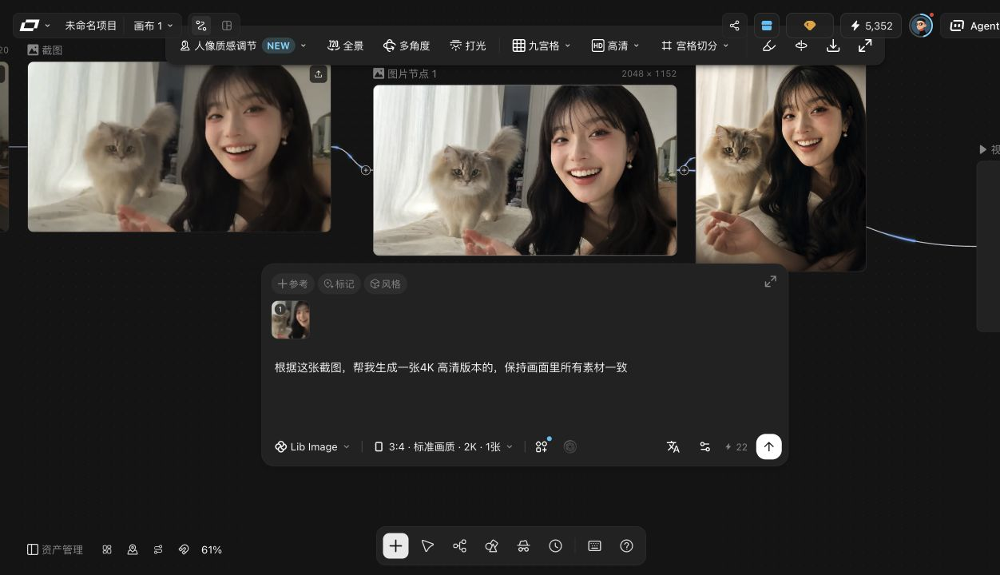
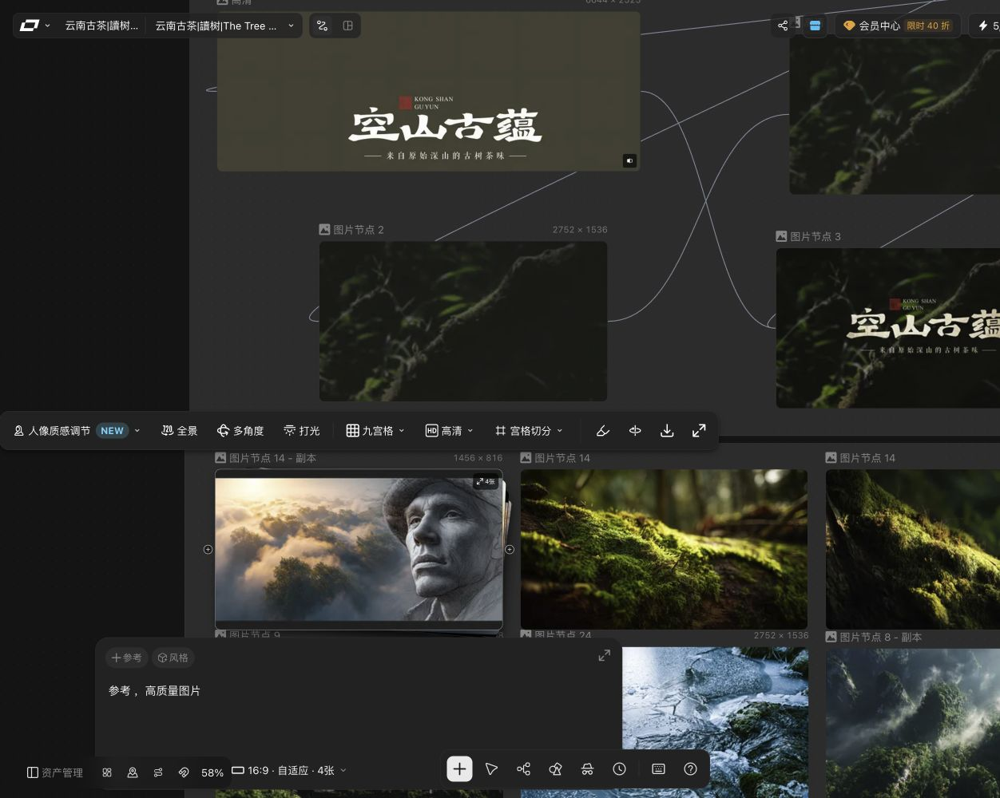
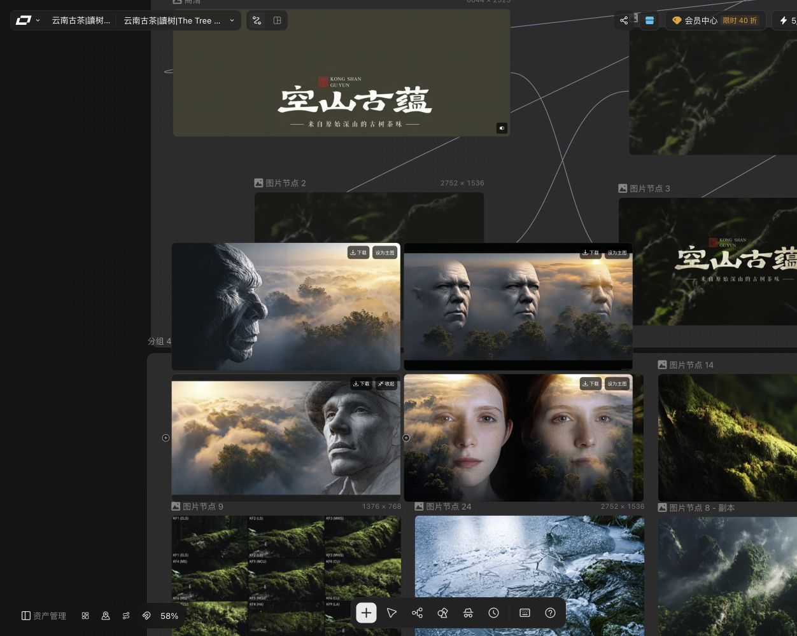
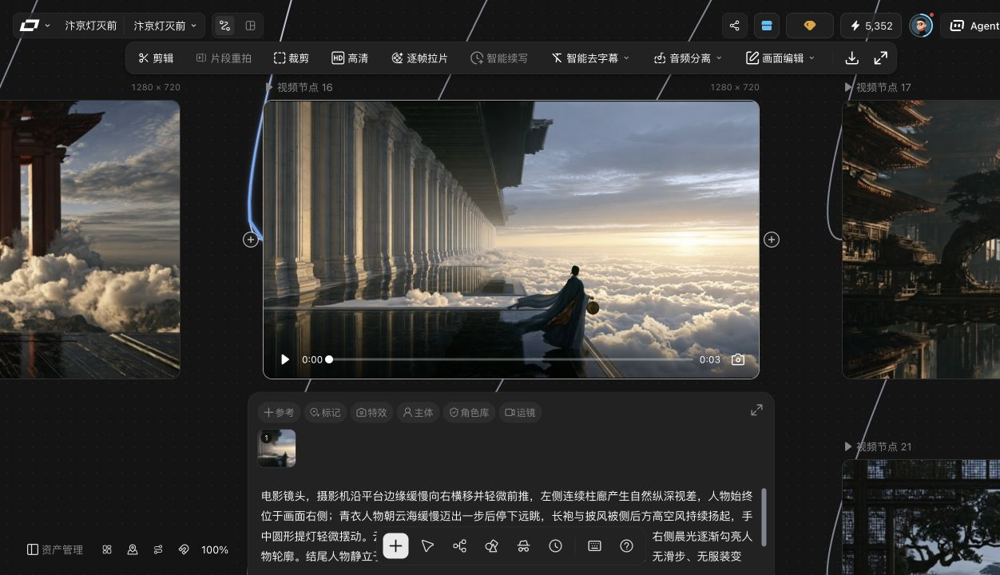

# LibLib 结果态功能实机核对（2026-08-23）

## 1. 审计范围与纪律

- 审计环境：LibLib 登录态网页，浏览器视口临时设为 1440 × 1000。
- 入口：`/project` 最近项目列表，进入已有图片结果、四图结果和视频结果的画布。
- 操作边界：只选中节点、展开既有结果和悬停查看提示；未点击生成、使用 Skill、确认、设为主图或任何可能消耗积分的动作。
- 记录口径：页面实际可见内容记为“实测”；仅依据文案或组件关系推断的行为单独标为“推断”，不混入实测结论。
- 本地对照：静态阅读 `ImageNodeDetails.tsx`、`VideoNodeDetails.tsx`、`AssetNode.tsx`、`CanvasWorkspace.tsx`、`VideoContextTools.tsx`，未修改产品代码。

## 2. 找到的有结果项目

| 用途 | 项目 / 画布 | 实测节点 | 结果信息 |
| --- | --- | --- | --- |
| 视频结果态 | 汴京灯灭前 | 视频节点 16 | Kling O3，1280 × 720，3.04 秒，成本 24 |
| 单图片结果态 | 未命名项目 / 画布 1 | 图片节点 1、图片节点 2 | Lib Image，2048 × 1152 / 1536 × 2048 |
| 多图片结果态 | 云南古茶｜讀树｜The Tree Remembers - 副本 | 图片节点 14 - 副本 | Style Image V7，4 张，1456 × 816，成本 25 |

因此，本次账号内存在可用的图片和视频结果节点，无需新建任务或消耗积分。

## 3. 图片结果态实测

### 3.1 单图结果节点的结构

选中已有结果的图片节点后，界面由上到下分为：

1. 节点标题与媒体框；
2. 媒体框上方的结果处理浮动工具条；
3. 媒体框内部的生成结果、尺寸与结果数量入口；
4. 媒体框下方独立 composer：操作 chips、提示词、模型、参数摘要、高级设置、AutoLink、成本和生成按钮。

### 3.2 图片结果处理工具条：11 项

顺序以从左到右为准。

| 序号 | 名称 | 图标 / 形态 | 分组与悬浮提示 | 实测状态 |
| ---: | --- | --- | --- | --- |
| 1 | 人像质感调节 | 人像轮廓图标，带 `NEW` 标记和下拉箭头 | 文本按钮组；未出现独立 tooltip | 可用，表示有二级菜单 |
| 2 | 全景 | `720` 环绕图标 | tooltip：`基于当前场景创建720°全景图` | 可用 |
| 3 | 多角度 | 环绕 / 轨道图标 | tooltip：`多角度` | 可用 |
| 4 | 打光 | 放射光线图标 | tooltip：`打光` | 可用 |
| 5 | 九宫格 | 3 × 3 网格图标，带下拉箭头 | 文本按钮组 | 可用，表示有二级菜单 |
| 6 | 高清 | `HD` 方形徽标 | 文本按钮组 | 可用 |
| 7 | 宫格切分 | 分格图标，带下拉箭头 | 文本按钮组 | 可用，表示有二级菜单 |
| 8 | 标注 | 标注 / 橡皮图标 | 从此项开始为紧凑图标组；tooltip：`标注` | 可用 |
| 9 | 旋转 | 循环旋转图标 | tooltip：`旋转` | 可用 |
| 10 | 下载 | 向下箭头进入托盘 | tooltip：`下载` | 可用 |
| 11 | 预览 | 对角展开箭头 | tooltip：`预览` | 可用 |

排版特征：11 项位于同一个暗色圆角浮层；前 7 项保留文字，后 4 项仅显示图标，通过间距和形态形成视觉次级组，没有显式竖分隔线。

### 3.3 顶部操作并非固定 5 项

任务描述中的“图生图 / 图片高清 / 参考 / 标记 / 风格 5 项”不是本次实机中所有结果节点的固定形态：

| 模型 / 结果状态 | 实测 composer 顶部操作 | 未出现项 |
| --- | --- | --- |
| Lib Image，单图结果 | 参考 → 标记 → 风格（3 项） | 图生图、图片高清 |
| Style Image V7，四图结果 | 参考 → 风格（2 项） | 图生图、图片高清、标记 |

结论：顶部操作随模型能力或节点状态动态收窄；“图片高清”在实测中位于结果处理工具条第 6 项，而不是固定 composer chip。不能把 5 项写成通用契约。

### 3.4 composer 参数区实测

#### Lib Image 单图结果

- 顶部 chips：参考、标记、风格。
- 提示词区：显示当前生成提示词。
- 模型：Lib Image。
- 参数摘要：`3:4 · 标准画质 · 2K · 1张`。
- 高级设置：可展开；AutoLink 为开启态。
- 成本：实测一个结果节点显示 22。

#### Style Image V7 四图结果

- 顶部 chips：参考、风格。
- 提示词：`参考，高质量图片`。
- 模型：Style Image V7。
- 参数摘要：`16:9 · 自适应 · 4张`。
- 高级设置字段：
  - 个性化风格 P value；
  - 风格化程度，实测值 100；
  - 怪异度，实测值 50；
  - 多样性，实测值 5；
  - AutoLink，开启。
- 成本：25。

### 3.5 多结果形态与状态切换

四图节点收起时，在媒体卡内显示紧凑入口 `4张`。点击后并非横向轮播，而是展开覆盖节点主要区域的 2 × 2 结果网格：

- 4 张大缩略图；
- 每张都有“下载”；
- 当前主图显示“收起”；
- 其余 3 张显示“设为主图”；
- 点击“收起”恢复单主图 + composer 状态。

未点击“设为主图”，因此“更新下游引用”等后续副作用仅能从按钮语义推断，本次不作为实测状态变化。工具条第 11 项“预览”只核对到入口与 tooltip，本次未展开其全屏查看器，不能据此确认是否采用轮播。

## 4. 视频结果态实测

### 4.1 结果卡与播放器

选中视频结果节点后，媒体卡内直接显示：

- 结果画面和尺寸 `1280 × 720`；
- 播放按钮；
- 当前时间 `0:00`；
- 可拖动进度条；
- 总时长 `0:03`；
- 右侧相机图标。

### 4.2 媒体处理层

| 序号 | 名称 | 图标 / 形态 | 状态 |
| ---: | --- | --- | --- |
| 1 | 剪辑 | 剪刀 | 可用 |
| 2 | 片段重拍 | 文本项 | 禁用；当前节点时长约 3 秒 |
| 3 | 裁剪 | 裁剪框 | 可用 |
| 4 | 高清 | HD 徽标 | 可用 |
| 5 | 逐帧拉片 | 胶片 / 分析图标 | 可用 |
| 6 | 智能续写 | 文本项 | 禁用 |
| 7 | 智能去字幕 | 字幕图标 + 下拉箭头 | 可用，有二级菜单 |
| 8 | 音频分离 | 音频图标 + 下拉箭头 | 可用，有二级菜单 |
| 9 | 画面编辑 | 闪光 / 编辑图标 + 下拉箭头 | 可用，有二级菜单 |
| 10 | 下载 | 仅图标 | 可用 |
| 11 | 预览 | 仅图标 | 可用 |

布局与图片工具条相同：暗色浮动条，处理动作在左，下载 / 预览收敛为右侧图标组。

### 4.3 帧操作层

在结果播放器附近可见一组帧操作：

1. 截取首帧；
2. 截取尾帧；
3. 截取当前帧；
4. 相机图标（当前帧截图入口）。

它们与播放器空间相邻，选中结果节点时可到达，不需要先进入独立的“完整视频工具”页面。

### 4.4 引用控制与生成参数

实测顶部控制顺序：

`参考 → 标记 → 特效 → 主体 → 角色库 → 运镜 → @引用`

其后为提示词区及参考缩略图，再依次是：

- 模型：Kling O3；
- 模式：全能参考；
- 参数摘要：`16:9 · 3s · 1个 ·`，最后一段在该节点为空；
- 智能分镜；
- 高级设置；
- AutoLink：开启；
- 成本：24；
- 生成按钮。

## 5. 状态切换契约

| 初始状态 | 用户动作 | 系统反馈 | 可观察状态变化 |
| --- | --- | --- | --- |
| 未选中结果节点 | 单击媒体卡 | 高亮节点并展示结果工具条和 composer | 结果工具与参数区出现 |
| 已选中图片节点 | 点击画布空白 / 选择别的节点 | 当前结果工具条和 composer 退出 | 仅新选中节点保留展开态 |
| 四图节点收起 | 点击 `4张` | 2 × 2 网格覆盖展开 | 主图标识转为“收起”，其他结果显示“设为主图” |
| 四图网格展开 | 点击“收起” | 返回单主图卡片 | composer 恢复可见 |
| 视频结果选中 | 查看播放器 / 工具条 | 播放、进度、时长、相机与处理动作均可到达 | 未执行处理，不产生节点变化 |

## 6. 与本地实现的差异清单

以下共计 **14 项差异**；“一致项”另列，不计入差异数。

| ID | 范围 | LibLib 实测 | 本地当前实现 | 结论 |
| --- | --- | --- | --- | --- |
| D01 | 图片顶部操作 | Lib Image 为 3 项，Style Image V7 为 2 项，随模型 / 状态变化 | 只要 `hasMedia` 就固定渲染图生图、图片高清、参考、标记、风格 5 项 | 需改为模型与状态驱动 |
| D02 | 图片高清入口 | 结果态只在 11 项工具条第 6 项观察到 | composer 顶部和结果工具条同时存在 | 本地有重复入口 |
| D03 | 人像质感调节 | 带 `NEW` 标记和下拉箭头 | 仅普通按钮 | 缺状态徽标与层级提示 |
| D04 | 全景图标 / 说明 | `720` 环绕图标，tooltip 明确为 720°全景 | 与多角度共用通用 Rotate3D 图标，按钮直接显示“全景” | 视觉语义不足 |
| D05 | 图片二级菜单提示 | 人像、九宫格、宫格切分均有下拉箭头 | 点击可开菜单，但按钮无箭头 | 缺层级可发现性 |
| D06 | 图片工具条分组 | 前 7 项文字按钮，后 4 项图标按钮 | 11 项均渲染图标 + 文字 | 密度和分组不一致 |
| D07 | 多结果计数 | `4张`，无空格 | `4 张`，有空格 | 文案排版细微差异 |
| D08 | 视频卡播放器 | 卡片内直接有播放、进度、当前 / 总时长、相机 | 基础媒体卡的 `<video>` 无 `controls`，完整控制主要在预览层 | 结果卡缺直接播放器控制 |
| D09 | 视频工具条尾部 | 下载、预览为图标按钮 | 两项都渲染图标 + 文字 | 工具条密度不一致 |
| D10 | 视频二级菜单提示 | 智能去字幕、音频分离、画面编辑带下拉箭头 | 菜单存在，但入口无箭头 | 缺层级可发现性 |
| D11 | 视频顶部控制 | 主体位于特效与角色库之间 | primary row 没有“主体”，只在展开后的引用与控制层中存在 | 主入口缺项 |
| D12 | 视频帧操作位置 | 紧邻播放器，可在结果态直接到达 | 需点“展开完整视频工具”后才显示 | 操作层级更深 |
| D13 | 视频参数摘要 | `16:9 · 3s · 1个 ·`，该节点未显示清晰度值 | 本地固定组织为比例 · 清晰度 · 时长 · 数量 | 顺序与空值策略不一致 |
| D14 | 视频参考呈现 | prompt 区同时显示参考缩略图，顶部有 `@` 引用入口 | primary row 主要显示引用数量，参考素材缩略图不以同样方式内联 | 引用信息密度不同 |

### 6.1 已对齐项

- 本地图片结果工具条的 11 个动作名称和顺序与实测一致。
- 本地视频媒体处理工具的 11 个动作名称和顺序与实测一致。
- 本地四图结果也是 2 × 2 网格，包含下载、收起、设为主图；主结构与实测一致。
- 本地 Style Image 高级参数已包含 P 值、风格化、怪异度、多样性和 AutoLink，与本次实测字段集合一致。
- 本地片段重拍在短视频结果下有禁用原因，方向与 3.04 秒实测节点的禁用态一致。

## 7. 结论与后续优先级

本轮最重要的契约修正是：**图片结果态顶部操作不可固定为 5 项，必须由模型能力和结果状态决定**。其次是把结果态控件的“功能已经存在”与“LibLib 的入口层级 / 视觉密度”分开处理：本地多数工具已有，但视频播放器、主体入口、帧操作层级和图标化分组仍明显不同。

建议后续实现顺序：

1. 先修 D01–D02，建立图片结果态操作策略表，避免重复入口；
2. 再修 D08、D11–D14，使视频结果播放器和 composer 的信息层级对齐；
3. 最后统一 D03–D07、D09–D10 的徽标、下拉箭头、图标与密度。

## 8. 本次未覆盖项

- 未点击“设为主图”，未验证它是否有确认弹窗及下游引用提示。
- 未打开图片“预览”全屏层，未确认全屏查看是否为轮播。
- 未进入所有视频二级处理弹窗；本轮只核对结果态入口、顺序、禁用态与播放器层级。
- 未执行帧截取、下载、旋转、高清、拉片等可能产生文件或派生节点的动作。

